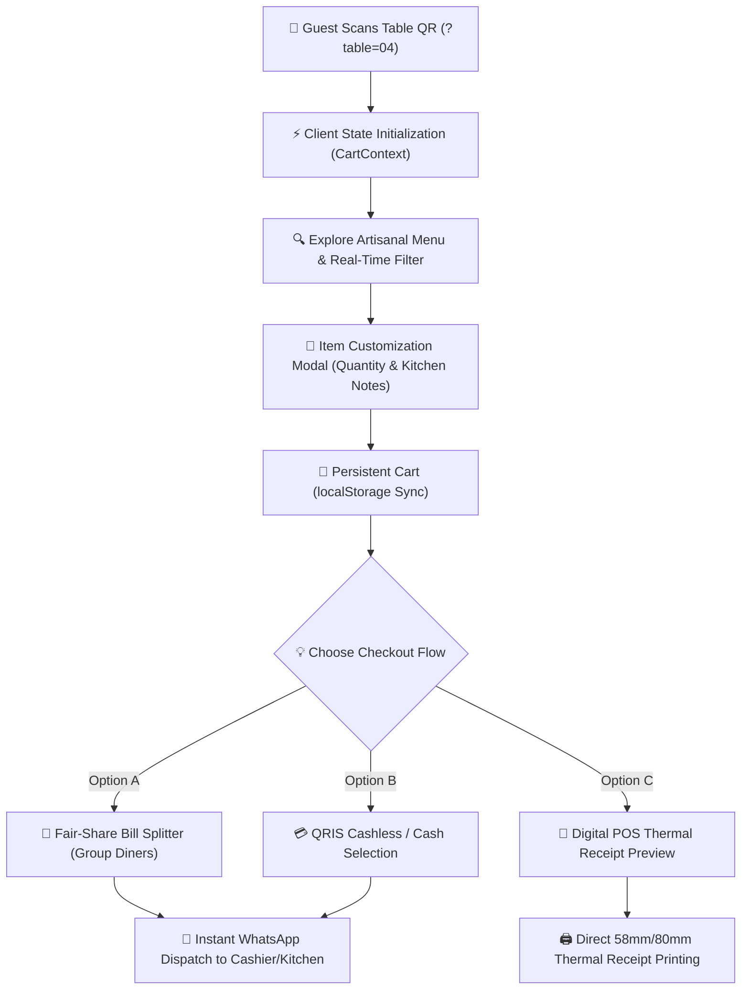

# ☕ Sentosa Cafe & Diner — Modern QR Table Ordering & Smart POS Experience

[](https://nextjs.org/)
[](https://react.dev/)
[](https://www.typescriptlang.org/)
[](https://tailwindcss.com/)
[](https://www.w3.org/WAI/standards-guidelines/wcag/)
[](https://playwright.dev/)

> **Live Production URL:** [https://modern-cafe-ordering-app.vercel.app](https://modern-cafe-ordering-app.vercel.app)  
> **GitHub Repository:** [https://github.com/zeno-syne/modern-cafe-ordering-app](https://github.com/zeno-syne/modern-cafe-ordering-app)  
> **Product Builder & QA Lead:** **Zeno** (Product Builder & QA Specialist)

---

## 📌 Executive Summary & Problem Statement

In the modern hospitality and specialty coffee industry, brick-and-mortar operators face recurring operational bottlenecks:
1. **Queue Bottlenecks & Order Miscommunications:** Cashiers and baristas struggle during evening and late-night rushes, leading to misplaced orders, wrong table deliveries, or lost kitchen customizations (*e.g., "oat milk substitution", "less sweet", "extra spicy sambal"*).
2. **Expensive SaaS POS Subscriptions:** Traditional cloud restaurant POS systems charge recurring monthly fees ($30 to $120+/month per tablet), heavily eroding profit margins for independent cafe owners.
3. **Customer App Fatigue:** Diners refuse to download dedicated native apps or complete multi-step signups just to order an iced latte and a sandwich.

### 💡 The Solution:
**Sentosa Modern Cafe Ordering App** is an ultra-fast, mobile-first web application requiring **zero app installation and zero account registration**:
* **Instant Table Binding:** Diners scan an acrylic QR stand at their table using standard phone cameras or Google Lens.
* **Custom Kitchen Orders:** Pick handcrafted espresso, artisan snacks, customize preparation notes, and review totals in real time.
* **Fair-Share Group Bill Splitter:** Effortlessly divides group dining bills with integer rounding to prevent fractional currency disputes.
* **Cashless QRIS & Instant WhatsApp Dispatch:** Formats orders into clean, structured dispatch messages sent directly to the barista/cashier WhatsApp queue.
* **Zero Recurring Cloud Overhead:** Runs entirely serverless with client-side state resilience.

---

## 🏗️ System Architecture & Data Flow



---

## 🚀 Core Features & Technical Highlights

### 1. Dynamic QR Table Binding (`?table=XX` / `?meja=XX`)
* Automatically parses URL query parameters (`?table=04`) upon landing, locking the active table into context and showing an active dine-in indicator pill.
* **Interactive Client Demo Simulator:** A floating header widget (`DemoTableSwitcher`) enables prospective clients, investors, and reviewers to simulate table switching or takeaway mode with one click.

### 2. Multi-Item Cart & State Persistence
* Architected with **React 19 Context API** paired with resilient `localStorage` synchronization.
* Customer carts survive accidental page refreshes, tab closures, and cellular reconnection drops.

### 3. Fair-Share Group Bill Splitter
* Dynamic bill splitting engine supporting **2 to 20 diners**.
* Utilizes integer ceiling division (`Math.ceil`) to ensure fair distribution and avoid fractional currency errors.
* Includes a **"Copy to Group Chat"** clipboard utility to post formatted breakdown messages into WhatsApp/Telegram groups.

### 4. Dual Payment Modes & Interactive QRIS Modal
* Seamless tender switching: **💵 Cash at Counter** vs. **📲 Counter QRIS (All Banks & Wallets)**.
* Authentic National QRIS modal with crisp vector SVG matrix code, merchant ID validation, and **"Copy Amount"** utility.

### 5. Digital Thermal Paper POS Receipt
* Emulates Toast / Square POS 58mm & 80mm thermal receipts with dot-matrix font rendering, serrated paper tear edges, order timestamp, and store Wi-Fi credentials (`sentosajuara2026`).
* Integrated `@media print` CSS rules allowing store operators or diners to physically print receipts on any standard thermal POS printer.

### 6. Printable Acrylic Table Tent QR Generator
* In-app store operations tool: cafe owners can generate and print high-resolution A6 table tent cards for tables 01 through 12, VIP booths, or custom tables.
* Includes 3-step customer onboarding instructions: *1. Scan QR &rarr; 2. Pick Items &rarr; 3. Fast Service*.

### 7. Deterministic Operational Hours Hook (`useOperationalStatus`)
* Calculates live open/closed states using standard `Asia/Jakarta (GMT+7)` timezone without server-side roundtrips:
  * **Weekdays (Mon–Fri):** 09:00 AM – 01:00 AM (GMT+7)
  * **Weekends (Sat–Sun):** 09:00 AM – 02:00 AM (GMT+7)
* Automatically adapts live status badges (*"🟢 Open for Dine-In & Takeaway"* vs *"🔴 Closed • Resting"*).

### 8. Accessibility & Ergonomics (WCAG 2.2 AA)
* **Keyboard Accessibility:** Global `Escape` key event listeners dismiss drawers, modal popovers, and dialogs cleanly.
* **Touch Targets:** 100% compliant with Apple Human Interface Guidelines and Android Material Design (minimum 44×44px touch bounding boxes).
* **Semantic ARIA:** Explicit `role="dialog"`, `role="radiogroup"`, `role="tablist"`, and live region announcements.

---

## 🛡️ Quality Assurance & Test.io Rigor

As a **Product Builder and QA Specialist**, this application was designed and tested according to crowdsourced quality benchmarks (such as **test.io** exploratory cycles):

| Test Area | Scope & Coverage | Status |
|:---|:---|:---:|
| **Core Flows** | Table detection &rarr; item addition &rarr; kitchen notes &rarr; WA order generation | ✅ PASS |
| **Edge Cases** | Boundary quantity counters, empty search queries, extreme note characters | ✅ PASS |
| **Split Bill Precision** | Zero-remainder rounding across odd guest numbers (e.g. 3, 7 diners) | ✅ PASS |
| **Responsiveness** | Tested across 375px (iPhone SE), 390px (iPhone 14/15), 768px (iPad), and 4K displays | ✅ PASS |
| **Keyboard Accessibility** | Tab navigation, visible focus rings, `Escape` key dismiss | ✅ PASS |
| **Automated E2E Suite** | Playwright automated integration tests | ✅ PASS |

📄 **[Explore Full QA Test Plan (TESTING_CHECKLIST.md)](./TESTING_CHECKLIST.md)**

---

## 🛠️ Technology Stack & Engineering Decisions

| Layer | Technology | Decision Rationale |
|:---|:---|:---|
| **Framework** | Next.js 16 (App Router) | Server-side rendering, zero client-bundle bloat, Turbopack sub-second rebuilds |
| **UI Library** | React 19 | Concurrent features, native hook ergonomics, lean component lifecycle |
| **Styling** | Tailwind CSS v4 | High-performance CSS engine with atomic responsive token architecture |
| **Icons** | Lucide React | Lightweight, tree-shakable SVG vector glyphs |
| **Testing** | Playwright | Multi-browser end-to-end regression validation |
| **Deployment** | Vercel Edge Network | Global low-latency CDN with automated preview builds |

---

## 💻 Running Locally

1. **Clone the repository:**
   ```bash
   git clone https://github.com/zeno-syne/modern-cafe-ordering-app.git
   cd modern-cafe-ordering-app
   ```

2. **Install dependencies:**
   ```bash
   npm install
   ```

3. **Start the development server:**
   ```bash
   npm run dev
   ```

4. **Open in browser:**
   ```text
   http://localhost:3000
   ```

5. **Run production build verification:**
   ```bash
   npm run build
   ```

6. **Run Playwright automated E2E tests:**
   ```bash
   npm run test:e2e
   ```

---

## 👤 Product Builder & Creator Profile

Crafted with engineering rigor and attention to detail by:
* **Creator:** **Zeno**
* **Role:** Product Builder, Frontend Engineer & QA Specialist (Freelance Tester at test.io)
* **GitHub:** [@zeno-syne](https://github.com/zeno-syne)
* **Live Product:** [https://modern-cafe-ordering-app.vercel.app](https://modern-cafe-ordering-app.vercel.app)

---

## 📄 License
Released under the [MIT License](LICENSE).
